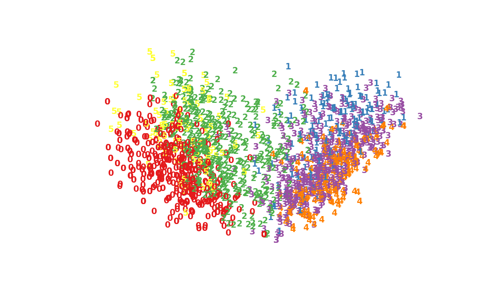
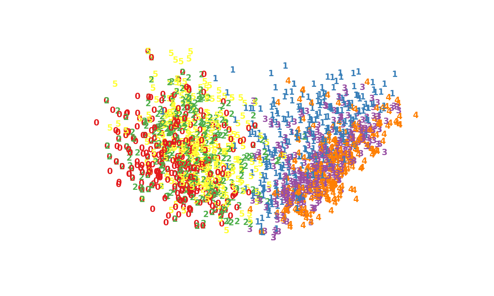
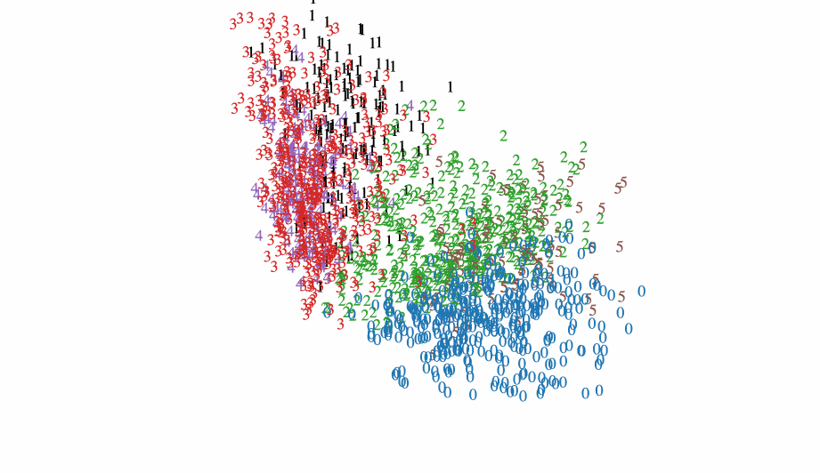

## Overview
This repository contains a program used to analyze job description postings. This repository started off as a project between [Leo Walker](https://github.com/leowalker89) and myself to help determine which data science skills we needed to best find a job. After more discussion and outreach from our peers we expanded into a lite web app that classifies between 6 job titles and tells you which words to add to your resume. This project uses predominantly PCA, NLP, unsupervised learning, and Flask.

Although the app is in development you can find it [here](http://ec2-34-229-237-160.compute-1.amazonaws.com:8105/submit?0). The the css, js, and html were created using a bootstrapped method from (http://getbootstrap.com/).

The job postings initially scraped for are:
* Data Scientist
* Data Analyst
* Data Engineer
* Front End Developer
* Back End Developer
* Fullstack Developer

We scraped from numerous big tech cities including:
* San Francisco
* Denver
* New York
* Seattle
* Portland

## processing

As this was a rather light project the methodology is not the complex. First, Leo scraped the data off of indeed. After that I started doing EDA on the data and playing with some NLP. I first tried using just a traditional count vectorizer but found that a term frequency inverse document frequency vectorizer (tf-idf) worked much better. This was unsurprising as many of the job postings were different lengths. Afterwords I realized I had an been amount of pollution in my data in that I didn't particularly want a lot of the words that I was seeing. As a result I added many words to my stop words, lemmatized the words and only kept certain parts of speech using spaCy.  

At this point I began exploring the data. Once I cleaned the data I went back and used the tf-idf vectorizer. The first thing I wanted to do was to see what the most important words in the data set and if I could actually pull out 6 topics or in this case 6 job positions. To do this I used non-negative matrix factorization and assumed 6 classes. The 50 most important words that contributed to each topic are shown below.
I have labeled them for convience based on what I assumed the topic to be based on the text

Topic 0: Front End Developer
>web end developer javascript css html design development website user php application browser mobile responsive code html5 jquery ui ux css3 understanding framework content creative page knowledge project interface create angular cross designer technology strong develop marketing react bootstrap digital standard platform wordpress app graphic js need maintain compatibility photoshop

Topic 1: Data Engineer
> datum hadoop engineer etl spark pipeline platform warehouse hive digital aws processing nosql python technology engineering tool source scala kafka cloud scale large implement infrastructure analytic sql database various modern redshift azure hbase scalable lake process ingestion architecture minimum architect set pig design streaming model governance store quality enable modeling

Topic 2: Back End Developer
>software development application design technology java technical stack test agile engineer web develop architecture cloud code engineering framework developer testing api spring knowledge computer tool integration strong lead database continuous problem project aws platform security write end need javascript process practice backend js programming scrum python react science node communication

Topic 3: Data Analyst
>datum analysis analyst analytic management information project reporting analyze process analytical sql perform excel knowledge statistical develop program database create healthcare quality level decision strong identify need research insight advanced manage internal communication key degree intelligence complex strategy analytics maintain tool access communicate risk multiple trend technical microsoft clinical marketing

Topic 4: Data Scientist
> machine scientist learning science datum model algorithm learn statistical python analytic predictive insight technique advanced marketing analysis research problem quantitative engineering modeling statistics deep lead mining ml large computer language method solve statistic mathematics phd physics unstructured develop ai visualization tool field experiment tensorflow sas states spark united optimization complex

Topic 5: Full Stack Developer
>net asp web sql mvc developer server application stack microsoft development angular software api vb object senior azure jquery database services entity wcf studio framework javascript windows develop procedure visual design strong knowledge store plus topic oriented core css programming associated ajax architect rest project charlotte programmer tfs write ssis
`

This turned out pretty well. I think these words could accurately predict the labels I went with.

This ended up being pretty interesting and so I wanted to determine exactly how many of each topic it ended up classifying. I started with approximately 340 job posts per position and here is what I classified using an unsurpuvised method.

|Job Position|Number of Postings|Label|
|------------|------------------|-----|
|Front End Developer| 520|0|
|Data Engineer | 185|1|
|Back End Developer | 506|2|
|Data Analyst | 469|3|
|Data Scientist| 239|4|
|Full Stack Developer| 115|5|

Looks like it's a good time to be a web developer, lots of people want your skillset, whether they know it or not!

At this point I was curious to see how accurate the job titles and positions were to the actual postings. As a result I tried to see if I could naturally visualize any clusters I found using principle component analysis (PCA). The PCA embedding plot turned out to be very interesting when I labeled it with our topic labels:

<b>Figure 1:</b> NMF Labels Depicted in two Principle Components

<b>Figure 2:</b> Real Labels Depicted in two Principle Components

 Based on the embedded PCA reduced plot, color aside, there is perhaps two groups. A left and a right group. Using the colors as categories this plot actually provides a lot of information. Assuming 0's and 2's are web developers (based on the topics above), the left side of the plot appears to be more developer based. Similarly if I'm correct in hypothesizing that 5 is full stack, there is certainly a logical overlap. Looking at the data field, we also see some interesting stuff. First off all of the data fields(1, 3, 4) are clustered on the right of the plot. This suggest there is certainly a difference in requested skills and descriptions between 'data' folk and 'web' folk. Further more it looks as if data science (4) is nested with analytics almost as if data science is a specialized subset of skills of data analytics, which once again is logical. The data engineers (1) are nested somewhere in between back end (2) and the data analyst/scientist (3,4) jobs. This once again is a somewhat logical conclusion.

Comparing the actual labels and the predicted labels is somewhat interesting. First it appears although people might specify a web developer position, they really are looking for specific skill sets. This does not appear to be as true on the data side. One hypothesis is that in the data industry there are more transferable skills and people are not quite as specialized with specific languages or packages.

I attempted to plot the NMF labeled embedding plot and the html rendering can be found [here](job_descriptions_label.html). As a spoiler here is a gif, sorry about the frame rate!

<b>Figure 3:</b> NMF Labels Depicted in 3 Principle Components

As a reminder:

|Job Position|Label|
|------------|-----|
|Front End Developer|0|
|Data Engineer |1|
|Back End Developer |2|
|Data Analyst |3|
|Data Scientist|4|
|Full Stack Developer|5|

This is pretty cool. The plot suggests that data engineers show some commonality with Back End Developers and Data scientists really exist in a pocket between them. I was really surprised at how logically the descriptions were labeled.

From here I used Flask to put together a lite front end that allowed people to input text from there resume and it suggested words they should include. This was done by first determining which of the topics they fit into and then comparing sets of their resume and the top 100 words in that topic.

## Future Plans
* Automate the scraping and create a database that continuously updates
* Try using an autoencoding net to determine principle components
* Update the web app to be more user friendly
* Do more analysis on just the data science postings.

## Tech Stack

* Scikit learning
* Plotly
* Flask
